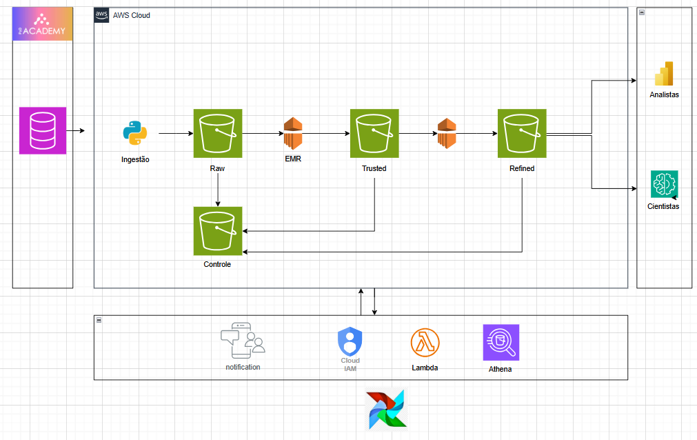

# Data Lake — PoD Cartões

## Visão Geral

Este projeto apresenta a construção de um Data Lake escalável para centralizar dados, garantir qualidade e viabilizar análises estratégicas.

A solução foi desenvolvida com foco em **estruturação de dados, escalabilidade e geração de insights de negócio**, utilizando processamento distribuído com PySpark e armazenamento em formato Parquet.

---

## Problema de Negócio

A PoD Cartões é uma empresa de serviços financeiros especializada em cartões de crédito, com uma base de milhares de clientes
em todo o Brasil. A empresa enfrenta desafios relacionados ao gerenciamento e aproveitamento de seus dados para melhorar as
operações e apoiar decisões estratégicas:

1. Armazenamento de dados:  
Os dados de clientes, transações e comportamento estão fragmentados em diferentes sistemas legados, dificultando a
consolidação e a confiabilidade das informações.

2. Suporte às operações:  
A infraestrutura atual não é capaz de lidar eficientemente com o aumento do volume, variedade e velocidade dos dados
gerados pela operação, impactando a escalabilidade e a agilidade da empresa.

3. Capacitação para modelagem preditiva:  
Os cientistas de dados enfrentam dificuldades para acessar e consumir dados organizados e de alta qualidade, o que limita
o desenvolvimento de modelos analíticos e preditivos que poderiam auxiliar na retenção de clientes, previsão de
inadimplência e personalização de ofertas.

## Objetivos

- Estruturar um Data Lake com dados financeiros
- Processar grandes volumes de dados com PySpark
- Criar métricas de inadimplência
- Gerar insights estratégicos para negócio

---

## Arquitetura do Data Lake

---

## Pipeline de Dados

1. Leitura de dados em formato Parquet  
2. Tratamento e padronização  
3. Criação de métricas de negócio  
4. Segmentação por faixa de atraso  
5. Identificação de clientes de alto risco  
6. Escrita em camada Gold para consumo analítico  

---

## Tecnologias Utilizadas

- AWS S3  
- Apache Spark (EMR)  
- Python  
- Parquet  
- AWS Lambda  
- AWS Athena  
- IAM  
- Power BI  

---

## Book de Variáveis

- U1M  
- U3M  
- U6M  
- U12M  

---

## Análises Desenvolvidas

- Distribuição de clientes  
- Inadimplência  
- Faixa de atraso  
- Clientes de risco  

---

## Principais Métricas

- Total de clientes  
- Clientes inadimplentes  
- Valor total em atraso  
- Ticket médio da dívida  
- Tempo médio de atraso  
- Distribuição por status de pagamento  

---

# Principais Resultados

- Mais de **10.000 clientes em atraso**  
- Média de **70 dias de atraso**  
- Volume relevante de dívidas acima de 90 dias (alto risco de perda)  

---

